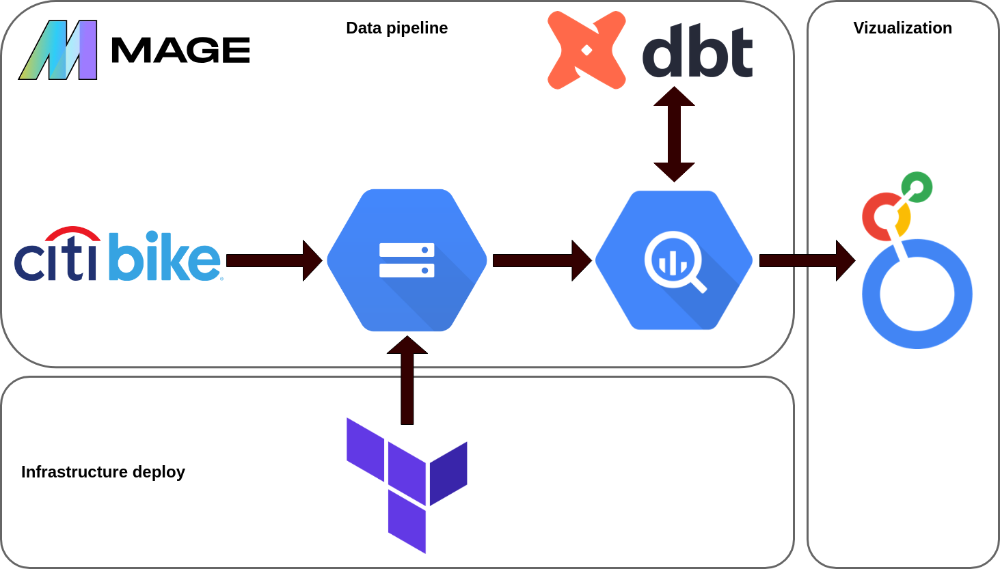
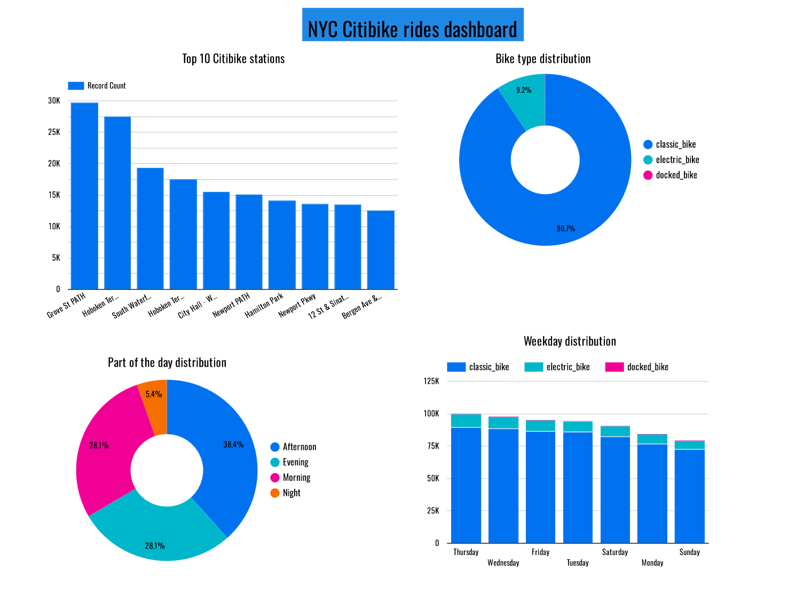

# NYC Citibike data pipeline

## **Project introduction** 
This repository is the final project of the [DEZoomcamp 2024](https://github.com/DataTalksClub/data-engineering-zoomcamp/tree/main) course. \
First of all, I would like to thank [DataTalksClub](https://github.com/DataTalksClub) for creating this course and giving the opportunity to take it for free, it's really amazing! \
In this project, we explore the [NYC Citibike rides dataset](https://s3.amazonaws.com/tripdata/index.html), which contains information about bike rides taken in New York City using the Citibike bike-sharing system. This project is use the dataset covers the second half of 2023 to insights and analyze.
## **Problem statement**
Our goal is to analyze usage patterns of the Citibike system in NYC during the second half of 2023, and identify trends that could inform future transportation planning. Specifically, we aim to answer the following questions: 
- What are the most popular Citibike stations?
- On which days of the week are the most trips made?
- What part of the day is the most common to make trips?
## **Technologies**
In this project, we will utilize a suite of modern technologies to build a robust and scalable data pipeline. These technologies include:
- **Data lake** - [Google Cloud Storage (GCS)](https://cloud.google.com/storage): will be used as our cloud storage solution. We will store our raw data and processed data in GCS buckets, allowing us to easily access and analyze the data using other GCP tools.
- **Infrastructure as Code (IaC)** - [Terraform](https://www.terraform.io/): is an open-source IaC tool that allows us to define and provision our cloud infrastructure using code. We will use Terraform to automate the deployment of our GCP resources, ensuring that our infrastructure is reproducible and scalable.
- **Workflow orchestration** - [MageAI](https://www.mage.ai/): is a data engineering platform that provides tools for building and orchestrating data pipelines. We will use MageAI to manage our workflows, schedule jobs, and monitor the performance of our pipeline.
- **Data transformation** - [dbt](https://www.getdbt.com/): dbt is a data transformation tool that allows us to define our transformations using SQL. We will use dbt to transform our raw data into a more structured and usable format, and to perform data quality checks.
- **Data warehouse** - [BigQuery](https://cloud.google.com/bigquery): is a fully-managed, serverless data warehouse that allows us to store and analyze large volumes of data. We will use BigQuery to store our processed data and perform data partitioning and clustering.
- **Dashboard** - [Looker Studio](https://lookerstudio.google.com/): is a data visualization tool that allows us to create interactive dashboards and reports. We will use Looker Studio to visualize our data and share insights with stakeholders. \
By leveraging these technologies, we aim to build a robust and scalable data pipeline that can handle large volumes of data and provide valuable insights into the usage patterns of the Citibike system in NYC.
## **Data pipeline**

The pipeline consists of the following main components:
- Using the MageAI orchestrator, we implement an ETL pipeline where we load data from the API, remove duplicates, and extract the data into the GCS bucket. Then pipeline load the data from the GCS and extract it into BigQuery data warehouse.
- Then using dbt we perform data transformation tasks such as, data type conversion, adding column with the ride duration and column which defining the part of the day when the ride taken. We also merge Citibike rides data with data from a file containing information about Citibike stations and add numeric station id from this file. The distinctive features of dbt - macros and seeds - were used in data processing.
- The transformed data is partitioned and clustered in BigQuery to optimize query performance. The data is partitioned by date and clustered by station ID.
## **Dashboard**
Below is a [dashboard](https://lookerstudio.google.com/s/hVFgIfuZ_GM) that provides answers to the questions posed. 

## **Reproducing**
To reproduce the project, you will need to follow the steps below. Note that you will need to have certain tools and credentials to complete the setup. 
  1. If you need to set up a virtual machine, account, project or service account in Google Cloud Platform, please refer to the [detailed instructions](https://github.com/DataTalksClub/data-engineering-zoomcamp/tree/main/01-docker-terraform/1_terraform_gcp) from the DataTalksClub team. Also, they have a [guide](https://github.com/DataTalksClub/data-engineering-zoomcamp/tree/main/01-docker-terraform/1_terraform_gcp/terraform) for perform the execution steps to create your Terraform infrastructure.
  2. Clone the project's GitHub repository to your local machine:
     ```
     git clone https://github.com/Siddha911/Citibike-data-project.git
  3. Run the following command to start the docker containers for MageAI and its underlying Postgres database:
     ```
     docker-compose -f mageai/docker-compose.yml up -d
  4. Then run this command to have a ready-made pipeline in your MageAI:
     ```
     mv pipeline/citibike_data_pipeline mageai/magic-zoomcamp/pipelines
  5. Using VS Code and having established a remote SSH connection to your VM through it and forwarded port 6789, you can now go to [http://localhost:6789](http://localhost:6789) to access the MageAI server instance and run citibike_data_pipeline.
  6. Now you can install dbt cloud once again using a great [guide](https://github.com/DataTalksClub/data-engineering-zoomcamp/blob/main/04-analytics-engineering/dbt_cloud_setup.md) from the incredible DataTalksClub 😊 to apply transformations and analysis using the files in the folders `dbt\models` and `dbt\macros`.
