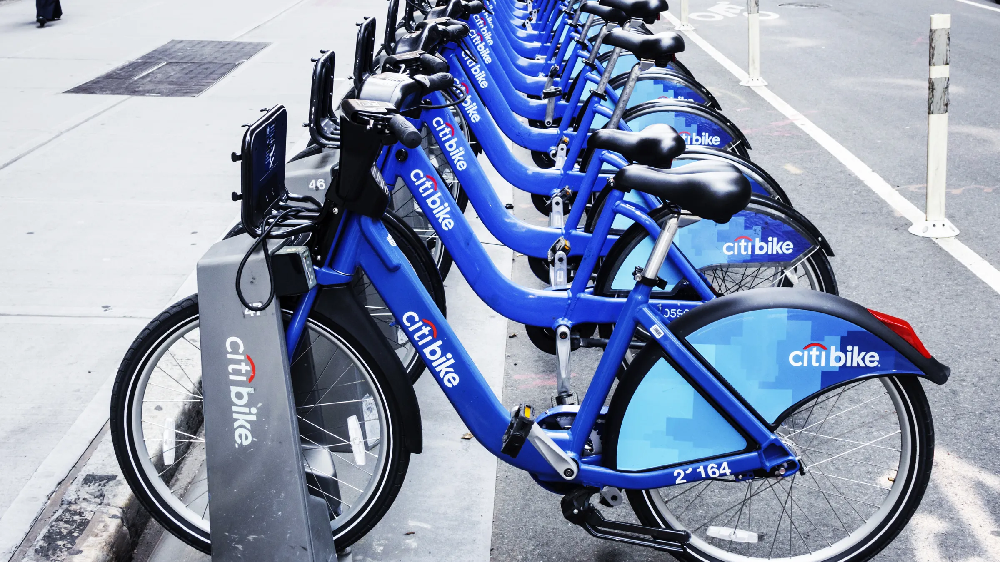

# NYC Citibike data pipeline

## **Project introduction** 
This repository is the final project of the [DEZoomcamp 2024](https://github.com/DataTalksClub/data-engineering-zoomcamp/tree/main) course. \
First of all, I would like to thank [DataTalksClub](https://github.com/DataTalksClub) for creating this course and giving the opportunity to take it for free, it's really amazing! \
In this project, we explore the [NYC Citibike rides dataset](https://s3.amazonaws.com/tripdata/index.html), which contains information about bike rides taken in New York City using the Citibike bike-sharing system. This project is use the dataset covers the second half of 2023 to insights and analyze.
## **Problem statement**
Our goal is to analyze usage patterns of the Citibike system in NYC during the second half of 2023, and identify trends that could inform future transportation planning. Specifically, we aim to answer the following questions: 
- What are the most popular Citi Bike stations?
- What are the most popular routes by subscriber type? 
- On which days of the week are the most trips made?
- What part of the day is the most common to make trips?
## **Technologies**
In this project, we will utilize a suite of modern technologies to build a robust and scalable data pipeline. These technologies include:
- **Data lake** - [Google Cloud Storage (GCS)](https://cloud.google.com/storage): will be used as our cloud storage solution. We will store our raw data and processed data in GCS buckets, allowing us to easily access and analyze the data using other GCP tools.
- **Infrastructure as Code (IaC)** - [Terraform](https://www.terraform.io/): is an open-source IaC tool that allows us to define and provision our cloud infrastructure using code. We will use Terraform to automate the deployment of our GCP resources, ensuring that our infrastructure is reproducible and scalable.
- **Workflow orchestration** - [MageAI](https://www.mage.ai/): is a data engineering platform that provides tools for building and orchestrating data pipelines. We will use MageAI to manage our workflows, schedule jobs, and monitor the performance of our pipeline.
- **Data transformation** - [dbt](https://www.getdbt.com/): dbt is a data transformation tool that allows us to define our transformations using SQL. We will use dbt to transform our raw data into a more structured and usable format, and to perform data quality checks.
- **Batch processing** - [Apache Spark](https://spark.apache.org/): is a powerful distributed computing engine that can process large volumes of data quickly and efficiently. We will use Spark to perform batch processing tasks.
- **Data warehouse** - [BigQuery](https://cloud.google.com/bigquery): is a fully-managed, serverless data warehouse that allows us to store and analyze large volumes of data. We will use BigQuery to store our processed data and perform complex SQL queries to generate insights.
- **Dashboard** - [Looker Studio](https://lookerstudio.google.com/): is a data visualization tool that allows us to create interactive dashboards and reports. We will use Looker Studio to visualize our data and share insights with stakeholders. \
By leveraging these technologies, we aim to build a robust and scalable data pipeline that can handle large volumes of data and provide valuable insights into the usage patterns of the Citibike system in NYC.
## **Data pipeline**
The pipeline consists of the following main components:
- Using the MageAI orchestrator, we implement an ETL pipeline where we extract data from the API, remove duplicates, and load the data into the GCS bucket
- 

